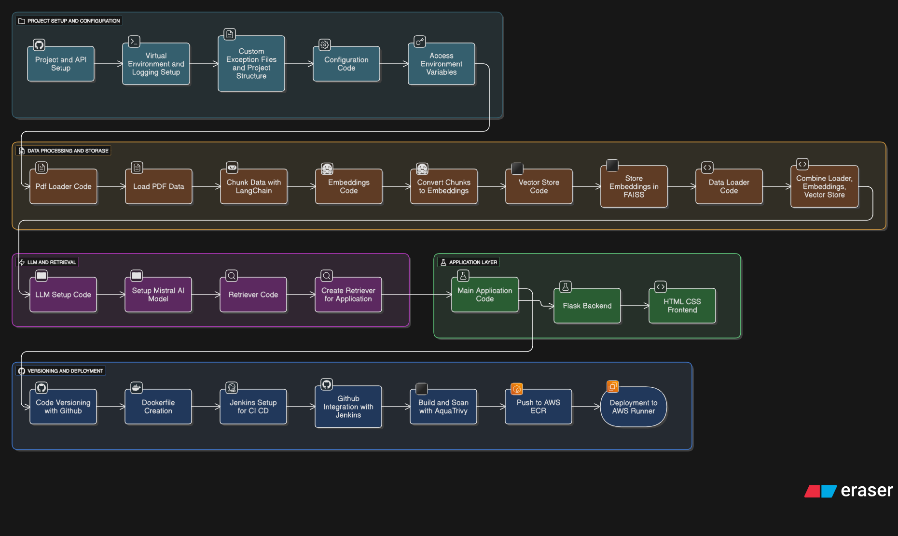

# Medical RAG Chatbot: AI-Powered Medical Query Assistant


[](https://github.com/HamzaImtiaz03/RAG-MEDICAL-CHATBOT)
[](https://opensource.org/licenses/MIT)
[](https://www.python.org/)
[](https://www.docker.com/)
[](https://aws.amazon.com/)

## Overview

The **Medical RAG Chatbot** is an advanced Retrieval-Augmented Generation (RAG) system designed to provide accurate, context-aware responses to medical queries. Leveraging state-of-the-art AI technologies, this chatbot retrieves relevant information from a comprehensive medical dataset and generates insightful answers using large language models (LLMs). 

The dataset powering this application is the **Gale Encyclopedia of Medicine**, a trusted reference containing detailed entries on diseases, treatments, procedures, and medical concepts. This ensures responses are grounded in reliable, encyclopedic knowledge while minimizing hallucinations common in generative AI.

This project demonstrates a full-stack AI application, from data ingestion and vector embeddings to a user-friendly web interface, secured deployment, and CI/CD pipelines. It's ideal for healthcare professionals, researchers, or enthusiasts seeking quick, evidence-based medical insights.

## Key Features

- **Retrieval-Augmented Generation (RAG)**: Combines semantic search with generative AI for precise, contextually relevant responses.
- **PDF Data Processing**: Ingests and chunks medical PDFs (e.g., Gale Encyclopedia) for efficient retrieval.
- **Vector Embeddings & Storage**: Uses FAISS for fast similarity search on embedded text chunks.
- **LLM Integration**: Powered by Mistral AI models via Hugging Face for natural language generation.
- **Web Interface**: Built with Flask, featuring a responsive HTML/CSS frontend for interactive querying.
- **Secure CI/CD Pipeline**: Automated builds, vulnerability scanning with Aqua Trivy, and deployment to AWS using Jenkins and Docker.
- **Scalable Deployment**: Containerized with Docker and hosted on AWS ECR and App Runner for high availability.
- **Environment Management**: Supports virtual environments and configurable API keys for secure operations.

## Architecture

The project follows a modular, end-to-end architecture as illustrated below:

 <!-- Replace with actual image URL or embed -->

### High-Level Breakdown:
1. **Project Setup & Configuration**: Virtual environment, API keys, logging, and exception handling.
2. **Data Processing & Storage**: Load PDFs, chunk data with LangChain, generate embeddings, and store in FAISS vector database.
3. **LLM & Retrieval**: Integrate Mistral AI LLM, set up retrievers for query-based information fetching.
4. **Application Layer**: Flask backend with routes for query handling, integrated with HTML/CSS frontend.
5. **Provisioning & Deployment**: GitHub versioning, Docker containerization, Jenkins CI/CD, Trivy scanning, AWS ECR push, and App Runner deployment.

This design ensures scalability, maintainability, and security throughout the lifecycle.

## Technologies Used

- **Core AI/ML**: LangChain (Community & Hugging Face integrations), FAISS (vector store), Hugging Face Hub (for embeddings and models).
- **Backend**: Flask (web framework), Python 3.10.
- **Data Handling**: PyPDF (PDF loader).
- **DevOps & Deployment**: Docker (containerization), Jenkins (CI/CD), Aqua Trivy (vulnerability scanning), AWS (ECR for registry, App Runner for hosting).
- **Environment**: Python-dotenv (for secrets management).
- **Version Control**: GitHub.

Full dependencies are listed in `requirements.txt`.

## Installation

### Prerequisites
- Python 3.10+
- Git
- Docker Desktop (for containerization)
- AWS Account (for deployment)
- Hugging Face API Token (for model access)

### Steps
1. **Clone the Repository**:
   ```
   git clone https://github.com/HamzaImtiaz03/RAG-MEDICAL-CHATBOT.git
   cd RAG-MEDICAL-CHATBOT
   ```

2. **Set Up Virtual Environment** (Recommended):
   ```
   python -m venv venv
   source venv/bin/activate  # On Unix/Mac
   # Or on Windows: venv\Scripts\activate
   ```

3. **Install Dependencies**:
   ```
   pip install -e .
   ```

4. **Configure Environment Variables**:
   Create a `.env` file in the root directory:
   ```
   HUGGINGFACE_API_TOKEN=your_huggingface_token
   # Add other keys as needed (e.g., AWS credentials for deployment)
   ```

5. **Prepare Dataset**:
   Place the Gale Encyclopedia of Medicine PDF(s) in the appropriate data directory (e.g., `data/`). The application will process these during runtime.

## Usage

1. **Run the Application Locally**:
   ```
   python app/application.py
   ```
   - Access the chatbot at `http://localhost:5000`.
   - Enter medical queries (e.g., "What are the symptoms of diabetes?") and receive RAG-enhanced responses.

2. **Query Examples**:
   - "Explain hypertension causes and treatments."
   - "What is the Gale Encyclopedia's definition of asthma?"
   - Responses are retrieved from the embedded dataset and augmented by the LLM.

3. **Customization**:
   - Modify chunking/retrieval parameters in LangChain configs.
   - Swap LLMs via Hugging Face integrations.

## Deployment

This project includes a robust CI/CD pipeline for seamless deployment to AWS.

### Prerequisites
- Jenkins setup (as detailed in `FULL_DOCUMENTATION.md`).
- AWS IAM user with ECR and App Runner permissions.
- GitHub Personal Access Token.

### Pipeline Overview (via Jenkinsfile)
1. **Clone Repo**: Pulls from GitHub.
2. **Build Docker Image**: Uses `Dockerfile` to create a production-ready image.
3. **Scan for Vulnerabilities**: Runs Aqua Trivy scans (reports archived).
4. **Push to AWS ECR**: Tags and uploads the image.
5. **Deploy to App Runner**: Triggers deployment on AWS for live hosting.

### Manual Deployment Steps
- Follow `FULL_DOCUMENTATION.md` for detailed Jenkins, Docker, and AWS setup.
- Build and push Docker image:
  ```
  docker build -t medical-rag-chatbot .
  ```
- Deploy to AWS App Runner via console or CLI.

Once deployed, access the live app via the App Runner URL provided in AWS Console.

## Contributing

Contributions are welcome! To get involved:
1. Fork the repository.
2. Create a feature branch (`git checkout -b feature/YourFeature`).
3. Commit changes (`git commit -m 'Add YourFeature'`).
4. Push to the branch (`git push origin feature/YourFeature`).
5. Open a Pull Request.

Please ensure code adheres to PEP8 standards and includes tests where applicable.

## License

This project is licensed under the MIT License - see the [LICENSE](LICENSE) file for details.

## Acknowledgments

- Dataset: Gale Encyclopedia of Medicine.
- Tools: Hugging Face, LangChain, AWS, Jenkins, Aqua Trivy.
- Inspired by modern RAG architectures for AI-driven healthcare solutions.

For questions or support, open an issue on GitHub or contact [Hamza Imtiaz](mailto:your.email@example.com).

---

*Built by Hamza Imtiaz | Empowering Medical Insights with AI*